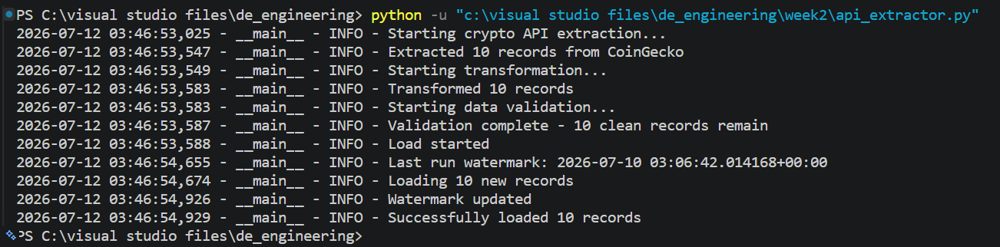
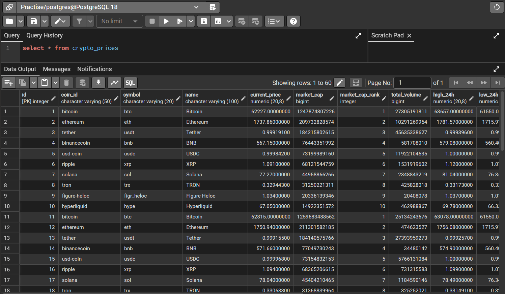
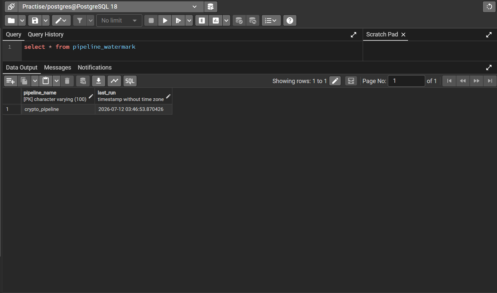

# Crypto Price ETL Pipeline

A Python-based ETL pipeline that extracts live cryptocurrency price data from the CoinGecko API, validates and cleans it, then loads it incrementally into a PostgreSQL database — avoiding duplicate inserts through a watermark-based tracking system.

This project is part of an 8-week self-directed learning roadmap to become a data engineer, building on core data analysis skills (SQL, Python, Power BI) toward production-style data pipeline design.

## Architecture

```
CoinGecko API → Extract → Transform → Validate → Load → PostgreSQL
```

Each stage is implemented as a separate Python class with a single responsibility, following the same Extractor / Transformer / Loader pattern used in production data pipelines.

## Tech Stack

- **Python** — pipeline logic and orchestration
- **pandas** — data transformation and cleaning
- **psycopg2** — PostgreSQL connectivity
- **PostgreSQL** — data warehouse / storage layer
- **requests** — API extraction
- **logging** (Python standard library) — structured, dual-output logging

## Key Features

- **Live API extraction** from the CoinGecko public API, with specific error handling for connection failures, timeouts, and HTTP errors — the pipeline fails gracefully instead of crashing
- **Data transformation** — selects relevant columns, converts types, adds extraction timestamps
- **Data quality validation** — a dedicated `DataValidator` class checks for null values in critical fields, duplicate records, invalid price ranges, and logical inconsistencies (e.g. 24h high lower than 24h low)
- **Incremental loading** — a watermark table tracks the last successful run, so only new or updated records are inserted, preventing duplicate data on repeated runs
- **Structured logging** — a file handler captures detailed `DEBUG`-level logs for troubleshooting, while the console only shows high-level `INFO` messages, keeping terminal output clean during normal operation

## Project Structure

```
week2/
├── api_extractor.py       # Main pipeline: Extractor, Transformer, Validator, Loader classes
├── README.md
├── requirements.txt
├── logs/
│   └── api_etl.log        # Detailed run logs (not committed)
└── screenshots/
    ├── terminal_run.png
    ├── crypto_prices_table.png
    └── watermark_table.png
```

## How to Run It

**1. Clone the repository**
```bash
git clone https://github.com/Anushangar-U/de_engineering.git
cd de_engineering/week2
```

**2. Install dependencies**
```bash
pip install -r requirements.txt
```

**3. Set up PostgreSQL**

Create a database (the pipeline expects one to already exist), then create the required tables:

```sql
CREATE TABLE pipeline_watermark (
    pipeline_name VARCHAR(100) PRIMARY KEY,
    last_run TIMESTAMP
);

INSERT INTO pipeline_watermark (pipeline_name, last_run)
VALUES ('crypto_pipeline', '2000-01-01 00:00:00');
```

The `crypto_prices` table is created automatically by the pipeline on first run.

**4. Update database credentials**

In `api_extractor.py`, update the `CryptoLoader.__init__` method with your own PostgreSQL host, database name, user, and password.

**5. Run the pipeline**
```bash
python api_extractor.py
```

## Sample Output

**Terminal — successful run:**



**PostgreSQL — `crypto_prices` table:**



**PostgreSQL — `pipeline_watermark` table:**



## What I Learned

Building this pipeline taught me the practical difference between analyst-level ETL (a one-off script) and engineer-level ETL (a system designed to run repeatedly and safely). Implementing incremental loading in particular clarified why naive re-running of a pipeline causes duplicate data at scale, and why watermark-based tracking is a standard solution. Debugging real environment issues — PostgreSQL authentication, timezone mismatches between API data and database timestamps — was as valuable as writing the pipeline logic itself.

## Future Improvements

- Orchestrate this pipeline with **Apache Airflow** for automated scheduling, retries, and failure alerting (in progress)
- Add **dbt** for SQL-based transformation and testing once data lands in the warehouse
- Move infrastructure to **AWS** (S3 for raw data, RDS for PostgreSQL) for a cloud-native setup
- Add additional data sources beyond CoinGecko for a richer dataset

## Author

Anushangar Uthayashangar — Data Science undergraduate, SLIIT